# Utah Government Contracting Hub - Database Design (ERD)

## Database Schema Overview

### Core Entities and Relationships

```mermaid
erDiagram
    %% User Management
    users {
        uuid id PK
        string email UK
        string password_hash
        string first_name
        string last_name
        string phone
        string company_name
        boolean is_active
        boolean is_verified
        timestamp created_at
        timestamp updated_at
        timestamp last_login
        uuid role_id FK
    }

    roles {
        uuid id PK
        string name UK
        string description
        json permissions
        string role_type
        timestamp created_at
    }

    organizations {
        uuid id PK
        string name UK
        string organization_type
        string description
        string website_url
        string contact_email
        string contact_phone
        string address
        string city
        string state
        string zip_code
        boolean is_active
        timestamp created_at
        timestamp updated_at
    }

    user_organizations {
        uuid id PK
        uuid user_id FK
        uuid organization_id FK
        string role_in_organization
        boolean is_primary
        timestamp created_at
    }

    csv_imports {
        uuid id PK
        uuid uploaded_by FK
        uuid organization_id FK
        string import_type
        string filename
        string original_filename
        string file_path
        integer total_rows
        integer processed_rows
        integer success_count
        integer error_count
        string status
        json validation_errors
        json processing_log
        timestamp created_at
        timestamp completed_at
    }

    csv_import_errors {
        uuid id PK
        uuid csv_import_id FK
        integer row_number
        string field_name
        string error_message
        string raw_data
        timestamp created_at
    }

    %% Business Profile Management
    business_profiles {
        uuid id PK
        uuid user_id FK
        string company_name UK
        string dba_name
        string cage_code UK
        string duns_number
        string uei_number
        string ein_number
        string state_license_number
        string website_url
        string description
        integer employee_count
        decimal annual_revenue
        string business_type
        boolean is_small_business
        integer profile_completeness_score
        timestamp created_at
        timestamp updated_at
        timestamp verified_at
    }

    business_addresses {
        uuid id PK
        uuid business_profile_id FK
        string address_type
        string street_address
        string city
        string state
        string zip_code
        string country
        decimal latitude
        decimal longitude
        boolean is_primary
        timestamp created_at
    }

    %% NAICS Code Management
    naics_codes {
        uuid id PK
        string code UK
        string title
        string description
        string sector
        string subsector
        string industry_group
        string industry
        string national_industry
        boolean is_active
        timestamp created_at
    }

    business_naics_codes {
        uuid id PK
        uuid business_profile_id FK
        uuid naics_code_id FK
        boolean is_primary
        timestamp created_at
    }

    %% Certification Management
    certifications {
        uuid id PK
        string name UK
        string code
        string description
        string category
        string issuing_authority
        boolean requires_renewal
        integer renewal_period_months
        timestamp created_at
    }

    business_certifications {
        uuid id PK
        uuid business_profile_id FK
        uuid certification_id FK
        string certificate_number
        date issue_date
        date expiration_date
        string status
        string document_url
        timestamp created_at
        timestamp updated_at
    }

    %% Service Categories
    service_categories {
        uuid id PK
        string name UK
        string description
        string category_type
        boolean is_active
        timestamp created_at
    }

    business_services {
        uuid id PK
        uuid business_profile_id FK
        uuid service_category_id FK
        string description
        string capabilities
        boolean is_primary
        timestamp created_at
    }

    %% Contract Vehicle Management
    contract_vehicles {
        uuid id PK
        string name UK
        string code
        string description
        string vehicle_type
        string issuing_agency
        date start_date
        date end_date
        boolean is_active
        timestamp created_at
    }

    business_contract_vehicles {
        uuid id PK
        uuid business_profile_id FK
        uuid contract_vehicle_id FK
        string contract_number
        date award_date
        date expiration_date
        decimal contract_value
        string status
        timestamp created_at
    }

    %% Government Contacts
    government_contacts {
        uuid id PK
        string name
        string title
        string agency
        string department
        string email
        string phone
        string address
        string city
        string state
        string zip_code
        string contact_type
        boolean is_active
        timestamp created_at
        timestamp updated_at
    }

    %% Opportunities
    opportunities {
        uuid id PK
        string opportunity_id UK
        string title
        text description
        string agency
        string contracting_office
        string opportunity_type
        string set_aside_type
        decimal estimated_value
        date posting_date
        date response_deadline
        date award_date
        string status
        string solicitation_number
        string naics_code
        string place_of_performance
        json requirements
        timestamp created_at
        timestamp updated_at
    }

    opportunity_naics_codes {
        uuid id PK
        uuid opportunity_id FK
        uuid naics_code_id FK
        timestamp created_at
    }

    opportunity_certifications {
        uuid id PK
        uuid opportunity_id FK
        uuid certification_id FK
        boolean is_required
        timestamp created_at
    }

    %% Matching and Analytics
    opportunity_matches {
        uuid id PK
        uuid opportunity_id FK
        uuid business_profile_id FK
        decimal match_score
        json match_criteria
        string match_status
        timestamp created_at
        timestamp updated_at
    }

    %% Document Management
    documents {
        uuid id PK
        uuid business_profile_id FK
        string document_type
        string filename
        string original_filename
        string file_path
        string mime_type
        integer file_size
        string status
        timestamp created_at
        timestamp updated_at
    }

    %% Notifications
    notifications {
        uuid id PK
        uuid user_id FK
        string notification_type
        string title
        text message
        json data
        boolean is_read
        timestamp created_at
        timestamp read_at
    }

    %% Audit Log
    audit_logs {
        uuid id PK
        uuid user_id FK
        string action
        string table_name
        uuid record_id
        json old_values
        json new_values
        string ip_address
        string user_agent
        timestamp created_at
    }

    %% Relationships
    users ||--o{ business_profiles : "owns"
    users ||--o{ notifications : "receives"
    users ||--o{ audit_logs : "generates"
    users ||--o{ user_organizations : "belongs_to"
    users ||--o{ csv_imports : "uploads"
    roles ||--o{ users : "has"
    organizations ||--o{ user_organizations : "has_members"
    organizations ||--o{ opportunities : "publishes"
    csv_imports ||--o{ csv_import_errors : "contains"
    
    business_profiles ||--o{ business_addresses : "has"
    business_profiles ||--o{ business_naics_codes : "has"
    business_profiles ||--o{ business_certifications : "has"
    business_profiles ||--o{ business_services : "offers"
    business_profiles ||--o{ business_contract_vehicles : "participates_in"
    business_profiles ||--o{ documents : "uploads"
    business_profiles ||--o{ opportunity_matches : "matched_to"
    
    naics_codes ||--o{ business_naics_codes : "assigned_to"
    naics_codes ||--o{ opportunity_naics_codes : "required_by"
    
    certifications ||--o{ business_certifications : "held_by"
    certifications ||--o{ opportunity_certifications : "required_by"
    
    service_categories ||--o{ business_services : "categorized_as"
    
    contract_vehicles ||--o{ business_contract_vehicles : "participated_in_by"
    
    opportunities ||--o{ opportunity_naics_codes : "requires"
    opportunities ||--o{ opportunity_certifications : "requires"
    opportunities ||--o{ opportunity_matches : "matched_with"
```

## Database Indexes for Performance

### Primary Indexes
- `users.email` - Unique index for login
- `business_profiles.cage_code` - Unique index for government identification
- `business_profiles.duns_number` - Index for legacy compatibility
- `business_profiles.uei_number` - Index for SAM.gov integration
- `opportunities.opportunity_id` - Unique index for government opportunity tracking
- `opportunities.posting_date` - Index for date-based queries
- `opportunities.status` - Index for status filtering
- `organizations.name` - Unique index for organization identification
- `csv_imports.uploaded_by` - Index for import tracking
- `csv_imports.status` - Index for import status queries

### Composite Indexes
- `opportunity_matches(opportunity_id, business_profile_id)` - For match lookups
- `business_naics_codes(business_profile_id, is_primary)` - For primary NAICS queries
- `notifications(user_id, is_read, created_at)` - For user notification queries
- `audit_logs(user_id, created_at)` - For user activity tracking
- `user_organizations(user_id, organization_id)` - For organization membership
- `csv_imports(organization_id, status, created_at)` - For import tracking

### Full-Text Search Indexes
- `business_profiles(company_name, description)` - For business search
- `opportunities(title, description)` - For opportunity search
- `naics_codes(title, description)` - For NAICS code search

## Data Security Considerations

### Encryption
- Password hashing using bcrypt with salt
- Sensitive data encryption at rest
- TLS/SSL for data in transit

### Access Control
- Role-based permissions system
- Row-level security for business data
- API rate limiting and authentication

### Audit Trail
- Comprehensive audit logging
- Data change tracking
- User activity monitoring

## Performance Optimizations

### Query Optimization
- Prepared statements for repeated queries
- Connection pooling
- Query result caching
- Database partitioning for large tables

### Caching Strategy
- Redis for session management
- Memcached for frequently accessed data
- CDN for static assets
- Browser caching for frontend resources

## Backup and Recovery

### Backup Strategy
- Daily automated backups
- Point-in-time recovery capability
- Cross-region backup replication
- Regular backup testing and validation

### Disaster Recovery
- Multi-zone deployment
- Automated failover procedures
- Data recovery procedures
- Business continuity planning 