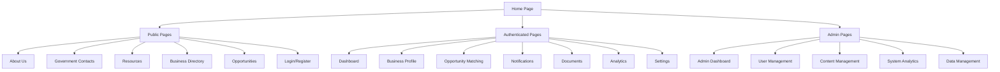

# Utah Government Contracting Hub - Frontend Sitemap

## Site Structure Overview



## Detailed Page Structure

### 🏠 **Public Pages (Unauthenticated)**

#### **1. Home Page (`/`)**
- **Hero Section**: Platform overview and value proposition
- **Quick Search**: Business and opportunity search
- **Featured Statistics**: Platform metrics and success stories
- **Recent Opportunities**: Latest government contracts
- **Government Officials**: Key contacts highlight
- **Call-to-Action**: Registration and login prompts

#### **2. About Us (`/about`)**
- **Mission Statement**: Platform goals and objectives
- **Team Information**: Key personnel and roles
- **Success Stories**: Business testimonials and case studies
- **Partnership Information**: Government and private sector partners

#### **3. Government Contacts (`/contacts`)**
- **Contact Directory**: Searchable government official database
- **Contact Categories**: 
  - Federal Officials
  - State Officials
  - Military Base Contacts
  - Procurement Officers
- **Contact Details**: Name, title, agency, contact information
- **Direct Contact Forms**: Secure messaging system

#### **4. Resources (`/resources`)**
- **Government Portals**: Direct links to official resources
- **Training Materials**: Educational content and guides
- **Document Templates**: Capability statements, proposals
- **Best Practices**: Industry guidelines and tips
- **Webinars & Events**: Upcoming training sessions

#### **5. Business Directory (`/businesses`)**
- **Search Interface**: Advanced filtering and search
- **Business Cards**: Company profiles with key information
- **Filter Options**:
  - NAICS Codes
  - Certifications
  - Location
  - Company Size
  - Services
- **Business Details**: Full company profiles (public view)

#### **6. Opportunities (`/opportunities`)**
- **Opportunity Feed**: Real-time contract postings
- **Search & Filter**: Advanced opportunity search
- **Opportunity Details**: Full contract information
- **Application Tracking**: Status of submitted applications

#### **7. Authentication (`/auth`)**
- **Login Form**: Email/password authentication
- **Registration Form**: Multi-step business registration
- **Password Reset**: Secure password recovery
- **Email Verification**: Account activation process

### 🔐 **Authenticated Pages (User Dashboard)**

#### **1. Dashboard (`/dashboard`)**
- **Overview Widgets**:
  - Profile Completeness Score
  - Recent Opportunities
  - Match Notifications
  - Document Status
  - Upcoming Deadlines
- **Quick Actions**: Common tasks and shortcuts
- **Recent Activity**: Latest platform interactions
- **Performance Metrics**: Success rates and statistics

#### **2. Business Profile (`/profile`)**
- **Profile Overview**: Company information summary
- **Edit Profile**: Update business information
- **NAICS Codes**: Manage industry classifications
- **Certifications**: Add and manage certifications
- **Services**: Define service offerings
- **Documents**: Upload and manage documents
- **Addresses**: Manage business locations

#### **3. Opportunity Matching (`/matching`)**
- **Match Dashboard**: Overview of opportunity matches
- **Match Criteria**: Configure matching preferences
- **Match Results**: View and filter matches
- **Match Details**: Detailed opportunity analysis
- **Application Tracking**: Track submitted applications
- **Saved Opportunities**: Bookmarked opportunities

#### **4. Notifications (`/notifications`)**
- **Notification Center**: All user notifications
- **Notification Types**:
  - Opportunity Matches
  - Profile Updates
  - Document Expirations
  - System Alerts
- **Notification Settings**: Configure alert preferences
- **Email Preferences**: Manage email notifications

#### **5. Documents (`/documents`)**
- **Document Library**: All uploaded documents
- **Document Categories**:
  - Capability Statements
  - Certifications
  - Past Performance
  - Financial Documents
  - Legal Documents
- **Document Upload**: Secure file upload system
- **Document Status**: Approval and verification status
- **Document Sharing**: Share documents with partners

#### **6. Analytics (`/analytics`)**
- **Performance Dashboard**: Business performance metrics
- **Opportunity Analysis**: Match success rates
- **Market Intelligence**: Industry trends and insights
- **Competitive Analysis**: Market positioning
- **Export Reports**: Download performance reports

#### **7. Settings (`/settings`)**
- **Account Settings**: Personal information management
- **Security Settings**: Password and security preferences
- **Notification Preferences**: Alert configuration
- **Privacy Settings**: Data sharing preferences
- **API Access**: Third-party integration settings

### 👨‍💼 **Admin Pages (Administrative Access)**

#### **1. Super Admin Dashboard (`/admin`)**
- **System Overview**: Platform health and metrics
- **Organization Management**: All government and business organizations
- **User Statistics**: Registration and activity data
- **System Alerts**: Critical system notifications
- **Platform Configuration**: System settings and maintenance

#### **2. Organization Management (`/admin/organizations`)**
- **Government Organizations**: Manage all government entities
- **Business Organizations**: Manage all business entities
- **Organization Hierarchy**: Parent-child organization relationships
- **Organization Analytics**: Performance metrics by organization

#### **3. User Management (`/admin/users`)**
- **User Directory**: All registered users across organizations
- **User Details**: Individual user information and permissions
- **Role Management**: User role assignments and permissions
- **Account Status**: Active/inactive user management
- **User Analytics**: User behavior and activity patterns

#### **4. CSV Import Management (`/admin/imports`)**
- **Import Dashboard**: Overview of all CSV imports
- **Import Templates**: Download templates for different data types
- **Import History**: Track all import operations
- **Error Reports**: View and resolve import errors
- **Bulk Operations**: Manage large-scale data imports

#### **5. Content Management (`/admin/content`)**
- **Government Contacts**: Manage contact database
- **NAICS Codes**: Update industry classifications
- **Certifications**: Manage certification types
- **Resources**: Update resource links and content
- **Opportunities**: Manage opportunity data

#### **6. System Analytics (`/admin/analytics`)**
- **Platform Metrics**: Overall system performance
- **User Analytics**: User behavior and engagement
- **Business Intelligence**: Market and trend analysis
- **Performance Reports**: System performance data

#### **7. Data Management (`/admin/data`)**
- **Data Import/Export**: Bulk data operations
- **Data Validation**: Data quality checks
- **Backup Management**: System backup operations
- **Audit Logs**: System activity monitoring

### 🏛️ **Government Organization Admin Pages**

#### **1. Government Admin Dashboard (`/gov-admin`)**
- **Organization Overview**: Government entity metrics
- **Opportunity Management**: Create and manage opportunities
- **User Management**: Manage organization users
- **Analytics**: Organization-specific performance data

#### **2. Opportunity Management (`/gov-admin/opportunities`)**
- **Create Opportunities**: Add new contract opportunities
- **Opportunity List**: View and manage all opportunities
- **CSV Import**: Bulk import opportunities
- **Application Review**: Review business applications
- **Opportunity Analytics**: Performance metrics

#### **3. User Management (`/gov-admin/users`)**
- **Organization Users**: Manage users within government entity
- **Role Assignment**: Assign roles to organization users
- **User Permissions**: Manage user access levels
- **User Activity**: Track user actions and performance

#### **4. CSV Import Center (`/gov-admin/imports`)**
- **Import Dashboard**: Organization-specific imports
- **Opportunity Import**: Bulk import contract opportunities
- **Contact Import**: Bulk import government contacts
- **Template Downloads**: Get CSV templates
- **Import History**: Track import operations

### 🏢 **Business Organization Admin Pages**

#### **1. Business Admin Dashboard (`/business-admin`)**
- **Organization Overview**: Business entity metrics
- **Business Profile Management**: Manage company information
- **User Management**: Manage organization users
- **Analytics**: Business performance data

#### **2. Business Profile Management (`/business-admin/profiles`)**
- **Profile Overview**: Company information summary
- **CSV Import**: Bulk import business profiles
- **Document Management**: Manage company documents
- **Certification Management**: Manage business certifications

#### **3. User Management (`/business-admin/users`)**
- **Organization Users**: Manage users within business entity
- **Role Assignment**: Assign roles to organization users
- **User Permissions**: Manage user access levels
- **User Activity**: Track user actions and performance

#### **4. CSV Import Center (`/business-admin/imports`)**
- **Import Dashboard**: Organization-specific imports
- **Business Profile Import**: Bulk import business information
- **Document Import**: Bulk import company documents
- **Template Downloads**: Get CSV templates
- **Import History**: Track import operations

## Navigation Structure

### **Primary Navigation**
```
Home | Business Directory | Opportunities | Government Contacts | Resources | About
```

### **User Navigation (Authenticated)**
```
Dashboard | Profile | Matching | Documents | Analytics | Settings | Logout
```

### **Super Admin Navigation**
```
Admin Dashboard | Organizations | Users | Imports | Content | Analytics | Data | Settings | Logout
```

### **Government Admin Navigation**
```
Gov Dashboard | Opportunities | Users | Imports | Analytics | Settings | Logout
```

### **Business Admin Navigation**
```
Business Dashboard | Profiles | Users | Imports | Analytics | Settings | Logout
```

## User Flows

### **New User Registration Flow**
1. Home Page → Register Button
2. Registration Form (Step 1: Basic Info)
3. Registration Form (Step 2: Business Info)
4. Registration Form (Step 3: NAICS Codes)
5. Registration Form (Step 4: Certifications)
6. Email Verification
7. Welcome Dashboard

### **Business Profile Completion Flow**
1. Dashboard → Profile Completeness Alert
2. Profile Wizard (Step 1: Basic Information)
3. Profile Wizard (Step 2: NAICS Codes)
4. Profile Wizard (Step 3: Services)
5. Profile Wizard (Step 4: Certifications)
6. Profile Wizard (Step 5: Documents)
7. Profile Review and Submission

### **Opportunity Matching Flow**
1. Dashboard → Opportunity Matching
2. Configure Match Criteria
3. View Match Results
4. Filter and Sort Matches
5. View Opportunity Details
6. Save or Apply to Opportunity
7. Track Application Status

### **Document Management Flow**
1. Dashboard → Documents
2. Select Document Category
3. Upload Document
4. Document Review and Approval
5. Document Status Tracking
6. Document Sharing (Optional)

## Mobile Navigation

### **Mobile Menu Structure**
```
☰ Menu
├── Home
├── Search
├── Business Directory
├── Opportunities
├── Government Contacts
├── Resources
├── About
└── Login/Register

User Menu (Authenticated)
├── Dashboard
├── Profile
├── Matching
├── Documents
├── Analytics
├── Settings
└── Logout
```

### **Mobile-Specific Features**
- **Bottom Navigation**: Quick access to main features
- **Swipe Gestures**: Intuitive navigation patterns
- **Touch-Optimized**: Large touch targets
- **Offline Capability**: Basic functionality without connection
- **Push Notifications**: Real-time alerts

## Accessibility Features

### **Navigation Accessibility**
- **Keyboard Navigation**: Full keyboard accessibility
- **Screen Reader Support**: ARIA labels and semantic HTML
- **High Contrast Mode**: Enhanced visibility options
- **Font Size Adjustment**: Scalable typography
- **Focus Indicators**: Clear focus management

### **Content Accessibility**
- **Alt Text**: Descriptive image alternatives
- **Semantic HTML**: Proper heading structure
- **Color Independence**: Information not conveyed by color alone
- **Caption Support**: Video and audio captions
- **Form Labels**: Clear form field identification

## SEO Structure

### **URL Structure**
```
/ - Home Page
/about - About Us
/contacts - Government Contacts
/resources - Resources
/businesses - Business Directory
/businesses/[id] - Business Profile
/opportunities - Opportunities
/opportunities/[id] - Opportunity Details
/auth/login - Login
/auth/register - Registration
/dashboard - User Dashboard
/profile - Business Profile
/matching - Opportunity Matching
/documents - Document Management
/analytics - Analytics
/settings - Settings
```

### **Meta Tags and SEO**
- **Page Titles**: Descriptive and keyword-rich
- **Meta Descriptions**: Compelling page summaries
- **Open Graph Tags**: Social media sharing optimization
- **Schema Markup**: Structured data for search engines
- **Canonical URLs**: Prevent duplicate content issues 