# Utah Government Contracting Hub - Complete Updated ERD

## 🗄️ **Complete Database Schema with All Advanced Features**

### **Core Entity Relationship Diagram**

```mermaid
erDiagram
    %% User Management & Authentication
    users {
        uuid id PK
        string email UK
        string password_hash
        string first_name
        string last_name
        string phone
        string company_name
        boolean is_active
        boolean is_verified
        timestamp created_at
        timestamp updated_at
        timestamp last_login
        uuid role_id FK
    }

    roles {
        uuid id PK
        string name UK
        string description
        json permissions
        string role_type
        timestamp created_at
    }

    organizations {
        uuid id PK
        string name UK
        string organization_type
        string description
        string website_url
        string contact_email
        string contact_phone
        string address
        string city
        string state
        string zip_code
        boolean is_active
        timestamp created_at
        timestamp updated_at
    }

    user_organizations {
        uuid id PK
        uuid user_id FK
        uuid organization_id FK
        string role_in_organization
        boolean is_primary
        timestamp created_at
    }

    %% Two-Factor Authentication
    two_factor_configs {
        uuid id PK
        uuid user_id FK
        string method
        text secret
        string phone_number
        string email
        boolean is_enabled
        timestamp setup_completed_at
        timestamp last_used_at
        timestamp created_at
        timestamp updated_at
    }

    backup_codes {
        uuid id PK
        uuid user_id FK
        string code_hash
        boolean is_used
        timestamp used_at
        timestamp created_at
    }

    %% Business Profile Management
    business_profiles {
        uuid id PK
        uuid user_id FK
        string company_name UK
        string dba_name
        string cage_code UK
        string duns_number
        string uei_number
        string ein_number
        string state_license_number
        string custom_platform_id
        string business_type
        string business_size
        integer employee_count
        decimal annual_revenue
        string primary_contact_name
        string primary_contact_email
        string primary_contact_phone
        string website_url
        text company_description
        text capabilities_statement
        integer profile_completeness_score
        boolean is_verified
        timestamp created_at
        timestamp updated_at
    }

    business_addresses {
        uuid id PK
        uuid business_profile_id FK
        string address_type
        string street_address
        string city
        string state
        string zip_code
        string country
        decimal latitude
        decimal longitude
        boolean is_primary
        timestamp created_at
    }

    %% NAICS Codes & Business Services
    naics_codes {
        uuid id PK
        string code UK
        string title
        string description
        string sector
        string subsector
        string industry_group
        string industry
        boolean is_active
        timestamp created_at
    }

    business_naics_codes {
        uuid id PK
        uuid business_profile_id FK
        uuid naics_code_id FK
        boolean is_primary
        integer years_experience
        text description
        timestamp created_at
    }

    %% Certifications & Set-Aside Programs
    certifications {
        uuid id PK
        string name UK
        string description
        string certifying_agency
        string category
        boolean is_active
        timestamp created_at
    }

    business_certifications {
        uuid id PK
        uuid business_profile_id FK
        uuid certification_id FK
        string certification_number
        date issue_date
        date expiration_date
        string status
        text notes
        timestamp created_at
    }

    %% Service Categories & Contract Vehicles
    service_categories {
        uuid id PK
        string name UK
        string description
        string category_type
        boolean is_active
        timestamp created_at
    }

    business_services {
        uuid id PK
        uuid business_profile_id FK
        uuid service_category_id FK
        text description
        integer years_experience
        boolean is_primary
        timestamp created_at
    }

    contract_vehicles {
        uuid id PK
        string name UK
        string description
        string vehicle_type
        string agency
        date start_date
        date end_date
        boolean is_active
        timestamp created_at
    }

    business_contract_vehicles {
        uuid id PK
        uuid business_profile_id FK
        uuid contract_vehicle_id FK
        string contract_number
        date award_date
        date expiration_date
        decimal contract_value
        string status
        timestamp created_at
    }

    %% Technology Stack Management
    technology_categories {
        uuid id PK
        string name UK
        text description
        uuid parent_category_id FK
        timestamp created_at
    }

    technologies {
        uuid id PK
        string name UK
        uuid category_id FK
        string version
        text description
        boolean is_active
        timestamp created_at
    }

    business_technologies {
        uuid id PK
        uuid business_profile_id FK
        uuid technology_id FK
        string expertise_level
        integer years_experience
        integer project_count
        boolean is_primary
        timestamp created_at
    }

    %% Past Performance Tracking
    past_projects {
        uuid id PK
        uuid business_profile_id FK
        string project_name
        string client_name
        string project_type
        text description
        date start_date
        date end_date
        decimal contract_value
        text[] naics_codes
        text[] technologies_used
        integer team_size
        string role_in_project
        decimal performance_rating
        string reference_contact_name
        string reference_contact_email
        string reference_contact_phone
        timestamp created_at
    }

    performance_ratings {
        uuid id PK
        uuid business_profile_id FK
        string rating_type
        date rating_period_start
        date rating_period_end
        decimal technical_rating
        decimal cost_rating
        decimal schedule_rating
        decimal management_rating
        decimal overall_rating
        string rating_agency
        string contract_number
        timestamp created_at
    }

    %% Financial & Capacity Information
    business_financials {
        uuid id PK
        uuid business_profile_id FK
        decimal annual_revenue
        decimal bonding_capacity
        decimal insurance_coverage
        string credit_rating
        decimal cash_reserves
        integer years_in_business
        timestamp created_at
        timestamp updated_at
    }

    %% Government Contacts
    government_contacts {
        uuid id PK
        string name
        string title
        string agency
        string department
        string email
        string phone
        string address
        string city
        string state
        string zip_code
        boolean is_active
        timestamp created_at
    }

    %% Enhanced Opportunities
    opportunities {
        uuid id PK
        string title
        text description
        string opportunity_number
        string agency_name
        string contracting_officer
        string contracting_officer_email
        string contracting_officer_phone
        decimal estimated_value_min
        decimal estimated_value_max
        date response_deadline
        date award_date
        string opportunity_type
        string set_aside_program
        string contract_vehicle
        string location
        decimal latitude
        decimal longitude
        string source_system
        string source_url
        text[] keywords
        uuid opportunity_type_id FK
        uuid fsg_code_id FK
        boolean is_active
        timestamp created_at
        timestamp updated_at
    }

    opportunity_types {
        uuid id PK
        string name UK
        text description
        timestamp created_at
    }

    fsg_codes {
        uuid id PK
        string code UK
        text description
        string category
        timestamp created_at
    }

    opportunity_keywords {
        uuid id PK
        uuid opportunity_id FK
        string keyword
        decimal weight
        timestamp created_at
    }

    opportunity_naics_codes {
        uuid id PK
        uuid opportunity_id FK
        uuid naics_code_id FK
        timestamp created_at
    }

    opportunity_certifications {
        uuid id PK
        uuid opportunity_id FK
        uuid certification_id FK
        timestamp created_at
    }

    %% Opportunity Matching
    opportunity_matches {
        uuid id PK
        uuid business_profile_id FK
        uuid opportunity_id FK
        decimal match_score
        decimal win_probability
        string match_category
        json match_details
        json recommendations
        boolean is_interested
        boolean is_excluded
        timestamp created_at
        timestamp updated_at
    }

    %% Documents & File Management
    documents {
        uuid id PK
        uuid business_profile_id FK
        string document_type
        string filename
        string original_filename
        string file_path
        string file_size
        string mime_type
        boolean is_verified
        timestamp created_at
    }

    %% Notifications & Alerts
    notifications {
        uuid id PK
        uuid user_id FK
        string notification_type
        string title
        text message
        string priority
        boolean is_read
        string action_url
        timestamp created_at
        timestamp read_at
    }

    %% CSV Import System
    csv_imports {
        uuid id PK
        uuid uploaded_by FK
        uuid organization_id FK
        string import_type
        string filename
        string original_filename
        string file_path
        integer total_rows
        integer processed_rows
        integer success_count
        integer error_count
        string status
        json validation_errors
        json processing_log
        timestamp created_at
        timestamp completed_at
    }

    csv_import_errors {
        uuid id PK
        uuid csv_import_id FK
        integer row_number
        string field_name
        string error_message
        text raw_data
        timestamp created_at
    }

    %% Audit Logs
    audit_logs {
        uuid id PK
        uuid user_id FK
        string action
        string entity_type
        uuid entity_id
        json old_values
        json new_values
        string ip_address
        string user_agent
        timestamp created_at
    }

    %% Relationships
    users ||--o{ user_organizations : "belongs_to"
    organizations ||--o{ user_organizations : "has_members"
    users ||--o{ two_factor_configs : "has_2fa"
    users ||--o{ backup_codes : "has_backup_codes"
    users ||--|| business_profiles : "has_profile"
    business_profiles ||--o{ business_addresses : "has_addresses"
    business_profiles ||--o{ business_naics_codes : "has_naics"
    business_profiles ||--o{ business_certifications : "has_certifications"
    business_profiles ||--o{ business_services : "provides_services"
    business_profiles ||--o{ business_contract_vehicles : "has_contracts"
    business_profiles ||--o{ business_technologies : "uses_technologies"
    business_profiles ||--o{ past_projects : "has_projects"
    business_profiles ||--o{ performance_ratings : "has_ratings"
    business_profiles ||--|| business_financials : "has_financials"
    business_profiles ||--o{ opportunity_matches : "matches_opportunities"
    business_profiles ||--o{ documents : "has_documents"
    users ||--o{ notifications : "receives_notifications"
    users ||--o{ csv_imports : "uploads_csv"
    csv_imports ||--o{ csv_import_errors : "has_errors"
    users ||--o{ audit_logs : "performs_actions"
    opportunities ||--o{ opportunity_naics_codes : "requires_naics"
    opportunities ||--o{ opportunity_certifications : "requires_certifications"
    opportunities ||--o{ opportunity_keywords : "has_keywords"
    opportunities ||--o{ opportunity_matches : "matched_by_businesses"
    naics_codes ||--o{ business_naics_codes : "used_by_businesses"
    naics_codes ||--o{ opportunity_naics_codes : "required_by_opportunities"
    certifications ||--o{ business_certifications : "held_by_businesses"
    certifications ||--o{ opportunity_certifications : "required_by_opportunities"
    service_categories ||--o{ business_services : "provided_by_businesses"
    contract_vehicles ||--o{ business_contract_vehicles : "used_by_businesses"
    technology_categories ||--o{ technologies : "contains_technologies"
    technologies ||--o{ business_technologies : "used_by_businesses"
    opportunity_types ||--o{ opportunities : "categorizes_opportunities"
    fsg_codes ||--o{ opportunities : "categorizes_opportunities"
    technology_categories ||--o{ technology_categories : "has_subcategories"
```



## 🔧 **Database Indexes for Performance**

### **Primary Indexes**
```sql
-- User Management
CREATE INDEX idx_users_email ON users(email);
CREATE INDEX idx_users_role_id ON users(role_id);
CREATE INDEX idx_users_is_active ON users(is_active);

-- Business Profiles
CREATE INDEX idx_business_profiles_cage_code ON business_profiles(cage_code);
CREATE INDEX idx_business_profiles_user_id ON business_profiles(user_id);
CREATE INDEX idx_business_profiles_is_verified ON business_profiles(is_verified);

-- Opportunities
CREATE INDEX idx_opportunities_agency_name ON opportunities(agency_name);
CREATE INDEX idx_opportunities_response_deadline ON opportunities(response_deadline);
CREATE INDEX idx_opportunities_estimated_value_min ON opportunities(estimated_value_min);
CREATE INDEX idx_opportunities_is_active ON opportunities(is_active);
CREATE INDEX idx_opportunities_created_at ON opportunities(created_at);

-- Opportunity Matches
CREATE INDEX idx_opportunity_matches_business_id ON opportunity_matches(business_profile_id);
CREATE INDEX idx_opportunity_matches_opportunity_id ON opportunity_matches(opportunity_id);
CREATE INDEX idx_opportunity_matches_match_score ON opportunity_matches(match_score);
CREATE INDEX idx_opportunity_matches_category ON opportunity_matches(match_category);
```

### **Composite Indexes**
```sql
-- Business NAICS Codes
CREATE INDEX idx_business_naics_business_naics ON business_naics_codes(business_profile_id, naics_code_id);

-- Opportunity Matches
CREATE INDEX idx_opportunity_matches_business_score ON opportunity_matches(business_profile_id, match_score DESC);

-- Business Technologies
CREATE INDEX idx_business_tech_business_tech ON business_technologies(business_profile_id, technology_id);

-- Performance Ratings
CREATE INDEX idx_performance_ratings_business_type ON performance_ratings(business_profile_id, rating_type);
```

### **Full-Text Search Indexes**
```sql
-- Opportunities Full-Text Search
CREATE INDEX idx_opportunities_fts ON opportunities USING gin(to_tsvector('english', title || ' ' || description));

-- Business Profiles Full-Text Search
CREATE INDEX idx_business_profiles_fts ON business_profiles USING gin(to_tsvector('english', company_name || ' ' || company_description || ' ' || capabilities_statement));

-- Keywords Full-Text Search
CREATE INDEX idx_opportunity_keywords_fts ON opportunity_keywords USING gin(to_tsvector('english', keyword));
```

## 🔒 **Data Security Considerations**

### **Encryption**
```sql
-- Encrypt sensitive data
ALTER TABLE business_profiles ALTER COLUMN ein_number SET ENCRYPTED;
ALTER TABLE business_profiles ALTER COLUMN cage_code SET ENCRYPTED;
ALTER TABLE two_factor_configs ALTER COLUMN secret SET ENCRYPTED;
ALTER TABLE backup_codes ALTER COLUMN code_hash SET ENCRYPTED;
```

### **Row-Level Security**
```sql
-- Enable RLS on sensitive tables
ALTER TABLE business_profiles ENABLE ROW LEVEL SECURITY;
ALTER TABLE opportunity_matches ENABLE ROW LEVEL SECURITY;
ALTER TABLE documents ENABLE ROW LEVEL SECURITY;

-- Create policies
CREATE POLICY business_profile_access ON business_profiles
    FOR ALL USING (user_id = current_user_id());

CREATE POLICY opportunity_match_access ON opportunity_matches
    FOR ALL USING (business_profile_id IN (
        SELECT id FROM business_profiles WHERE user_id = current_user_id()
    ));
```

## 📊 **Performance Optimizations**

### **Query Optimization**
```sql
-- Materialized views for complex queries
CREATE MATERIALIZED VIEW opportunity_match_summary AS
SELECT 
    bp.id as business_id,
    bp.company_name,
    COUNT(om.id) as total_matches,
    AVG(om.match_score) as avg_match_score,
    COUNT(CASE WHEN om.match_category = 'hot_lead' THEN 1 END) as hot_leads,
    COUNT(CASE WHEN om.match_category = 'good_match' THEN 1 END) as good_matches
FROM business_profiles bp
LEFT JOIN opportunity_matches om ON bp.id = om.business_profile_id
WHERE om.is_excluded = false
GROUP BY bp.id, bp.company_name;

-- Refresh materialized view
REFRESH MATERIALIZED VIEW opportunity_match_summary;
```

### **Caching Strategy**
```sql
-- Cache frequently accessed data
CREATE TABLE cache_opportunities (
    cache_key VARCHAR(255) PRIMARY KEY,
    cache_data JSONB,
    expires_at TIMESTAMP,
    created_at TIMESTAMP DEFAULT CURRENT_TIMESTAMP
);

CREATE INDEX idx_cache_opportunities_expires ON cache_opportunities(expires_at);
```

## 🔄 **Backup and Recovery**

### **Automated Backups**
```sql
-- Create backup procedures
CREATE OR REPLACE FUNCTION backup_critical_data()
RETURNS void AS $$
BEGIN
    -- Backup business profiles
    COPY business_profiles TO '/backups/business_profiles_' || current_date || '.csv' CSV HEADER;
    
    -- Backup opportunities
    COPY opportunities TO '/backups/opportunities_' || current_date || '.csv' CSV HEADER;
    
    -- Backup opportunity matches
    COPY opportunity_matches TO '/backups/opportunity_matches_' || current_date || '.csv' CSV HEADER;
END;
$$ LANGUAGE plpgsql;

-- Schedule daily backups
SELECT cron.schedule('daily-backup', '0 2 * * *', 'SELECT backup_critical_data();');
```

This complete ERD provides a solid foundation for all the advanced features we've discussed, including comprehensive matching, technology stack management, past performance tracking, and enhanced security with 2FA. The database design supports scalability, performance, and security requirements for a production government contracting platform. 